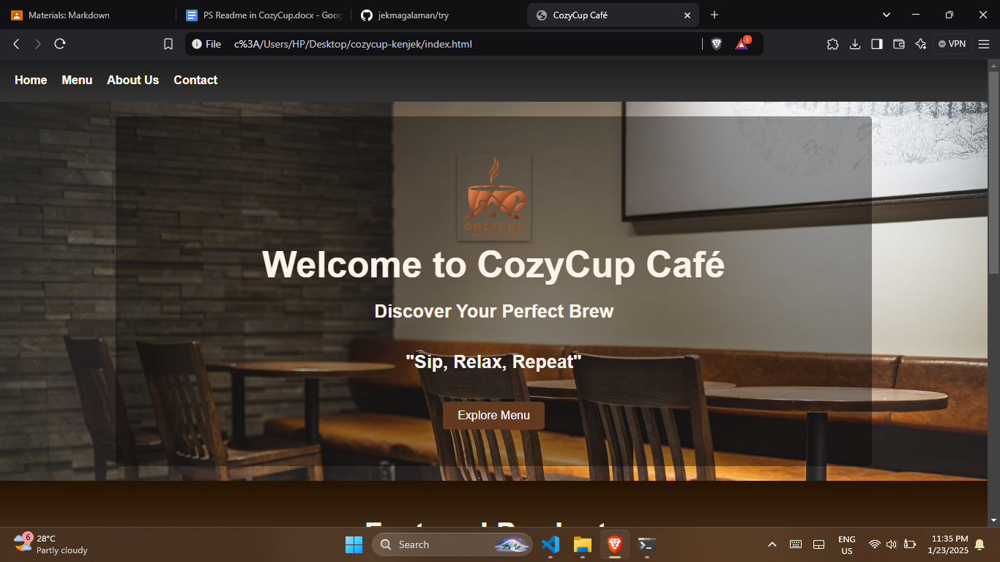

# Cozy Cup Cafe

## Project Description

The goal of the web application Cozy Cup Cafe is to make ordering coffee quick and simple. It only takes a few clicks for users to browse our menu, read our story, and contact us. Customers may explore featured products, view our entire menu, and even submit comments with ease thanks to the platform. Cozy Cup Cafe makes sure that the experience is easy and fun, whether you're purchasing coffee on the run or organizing your next cafe visit.

## Features

- Home page with a glimpse of the interior of Cozy Cup Cafe, featured products, and our social media platforms.
- Menu page that is user-friendly where you can easily see the list and price of our coffee menu, and also the list and price of our pastry menu.
- About page where you can know us better, this is where you can read the other things about the Cozy Cup Cafe, and you can also read and know our team, and also our mission.
- Contact page where you can see our address, a map with our location, a contact number, email address, and a message section for your opinions and comments.

## Screen Captures

### Homepage
  
  
  

### Menu
  
  

### About Page
  
  

### Contact Page
  
  
  

## About the Authors

**Name:** Jake Magalaman  
**Email:** 202020184@psu.palawan.edu.ph  

---

**Name:** Kenn Dainiel Paduga  
**Email:** 202080520@psu.palawan.edu.ph  

